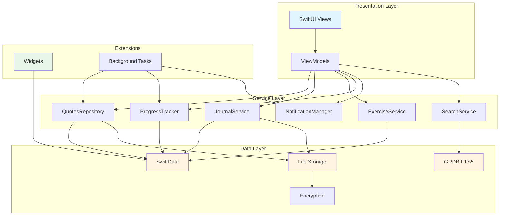
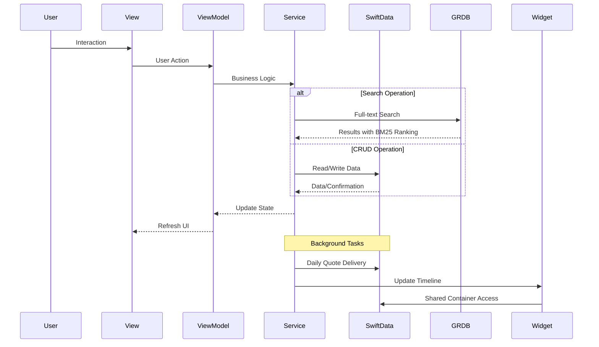

# Heauton

> **Heauton** (Greek: ἑαυτόν, "oneself") - A privacy-first wellness iOS app combining philosophical reflection with practical mental health tools.

**100% Offline** • **SwiftUI** • **iOS 17+** • **Local-First Architecture**

## What is Heauton?

A comprehensive wellness app for mindfulness, journaling, meditation, and personal growth. All data stays on your device with optional iCloud sync.

### Core Features

- **Philosophical Quotes** - Curated collection with daily delivery & widgets
- **Personal Journal** - Rich text entries with mood tracking and prompts
- **Wellness Exercises** - Guided meditation and breathing exercises
- **Progress Tracking** - Streaks, achievements, and mood analytics
- **Privacy-First** - Offline-first, AES-256 encryption, biometric lock
- **Liquid Glass Design** - Native iOS design with blur effects

## Architecture

### System Overview



### Data Flow



## Design System

Heauton iOS features the **Light Steel** monochrome color palette - a refined 9-shade grayscale system that creates a serene, distraction-free environment for mindfulness and personal reflection.

### Color Palette

```
Light Spectrum (Backgrounds & Surfaces)
F8F9FA  Bright Snow      - Primary backgrounds, main canvas
E9ECEF  Platinum         - Cards, modals, elevated surfaces
DEE2E6  Alabaster Grey   - Borders, dividers, input outlines
CED4DA  Pale Slate       - Secondary borders, disabled states
ADB5BD  Pale Slate 2     - Tertiary text, subtle icons

Dark Spectrum (Text & Interactive)
6C757D  Slate Grey       - Secondary text, metadata
495057  Iron Grey        - Primary actions, brand color
343A40  Gunmetal         - Headings, emphasis text
212529  Shadow Grey      - Body text, maximum contrast
```

### Design Philosophy

- **Mental clarity** - Monochrome design reduces cognitive load
- **Accessibility excellence** - WCAG AAA contrast ratios throughout
- **Native iOS integration** - Works seamlessly with SF Symbols and system components
- **Timeless aesthetics** - Professional, elegant visual language

### Implementation

Colors are defined in a SwiftUI extension with semantic mappings:

```swift
// Semantic color usage (recommended)
.background(.appBackground)         // Bright Snow
.foregroundStyle(.appText)          // Shadow Grey
.foregroundStyle(.appTextSecondary) // Gunmetal

// Direct palette access
.background(.lsBrightSnow)
.foregroundStyle(.lsShadowGrey)
.tint(.appPrimary)                  // Iron Grey
```

The color system supports light/dark mode and integrates naturally with SwiftUI's adaptive colors. For comprehensive usage guidelines, semantic mappings, and accessibility standards, see [COLOR_GUIDE.md](COLOR_GUIDE.md).

## Tech Stack

| Category | Technologies |
|----------|-------------|
| **Platform** | iOS 17+, Swift 5.9+, SwiftUI |
| **Design** | Light Steel Monochrome Palette |
| **Concurrency** | Structured Concurrency (async/await, Actor) |
| **Persistence** | SwiftData, GRDB (FTS5), File Storage |
| **Search** | GRDB FTS5 with BM25 ranking |
| **Security** | CryptoKit (AES-256-GCM), LocalAuthentication |
| **Widgets** | WidgetKit (Home Screen + Lock Screen) |
| **Testing** | XCTest (Unit + UI tests) |
| **CI/CD** | GitHub Actions, SwiftLint, SwiftFormat |

## Quick Start

```bash
# 1. Clone the repository
git clone <repo-url>
cd heauton-ios

# 2. Open in Xcode
open Heauton/Heauton.xcodeproj

# 3. Build and run (⌘R)
# The app will seed with sample data on first launch
```

### Requirements

- Xcode 15.0+
- iOS 17.0+ SDK
- Swift 5.9+

## Project Structure

```
Heauton/
├── Heauton/                      # Main app target
│   ├── Models/                   # SwiftData models
│   ├── Services/                 # Business logic (Actors)
│   │   ├── Search/              # Full-text search
│   │   └── Storage/             # File storage
│   ├── ViewModels/              # @Observable ViewModels
│   ├── Views/                   # SwiftUI views
│   └── Data/SampleData/         # Seed data
├── QuotesWidget/                # Widget extension
├── HeautonTests/                # Unit tests
└── HeautonUITests/              # UI tests
```

## Key Design Decisions

### Actor-Based Services
All services use Swift Actors for thread-safe, concurrent operations:

```swift
actor QuotesRepository {
    func fetchQuotes() async throws -> [Quote] { ... }
}
```

### SwiftData + GRDB Hybrid
- **SwiftData**: Primary data storage with @Model macros
- **GRDB**: Full-text search with FTS5 and BM25 ranking
- **File Storage**: Large content and encrypted data

### App Groups for Widgets
Shared container enables widgets to access SwiftData:

```swift
let container = ModelContainer(for: Quote.self,
    configurations: ModelConfiguration(groupContainer: .identifier("group.heauton")))
```

## Development

### Code Quality

```bash
# Format code
swiftformat .

# Lint code
swiftlint lint --strict

# Run tests
xcodebuild test \
  -project Heauton/Heauton.xcodeproj \
  -scheme Heauton \
  -destination 'platform=iOS Simulator,name=iPhone 16'
```

## Implementation Status

**Completed**
- Quote library with advanced search (GRDB FTS5)
- Daily quote scheduling & notifications
- Home Screen & Lock Screen widgets
- Journal with mood tracking & encryption
- Breathing & meditation exercises
- Progress tracking with streaks & achievements
- Biometric app lock (Face ID/Touch ID)

**In Progress**
- Markdown rendering for journal entries
- Additional widget types (streaks, prompts)
- Export functionality (PDF, JSON)

**Future**
- iCloud sync with CloudKit
- Apple Watch companion app
- Siri Shortcuts integration

## Privacy & Security

- **100% Offline** - No network access, no tracking, no analytics
- **Local-First** - All data stored on device
- **AES-256-GCM** - Encryption for sensitive journal entries
- **Biometric Lock** - Face ID / Touch ID app protection
- **No Third Parties** - Zero external dependencies for data

## License

See [LICENSE](LICENSE) for details.

---

**Built for personal growth and mindfulness**

Inspired by Stoic philosophy and modern wellness practices.
